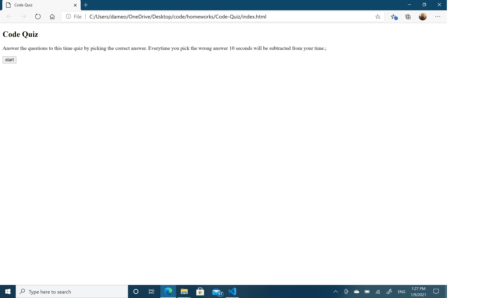
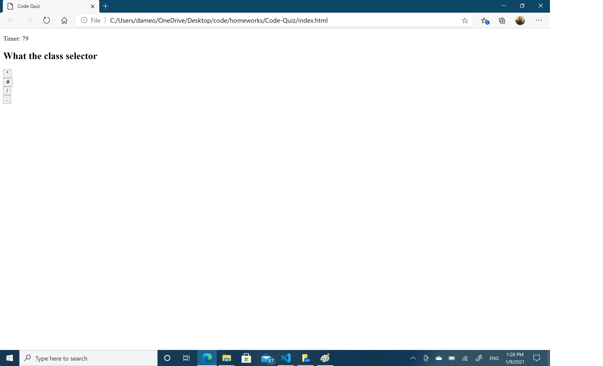
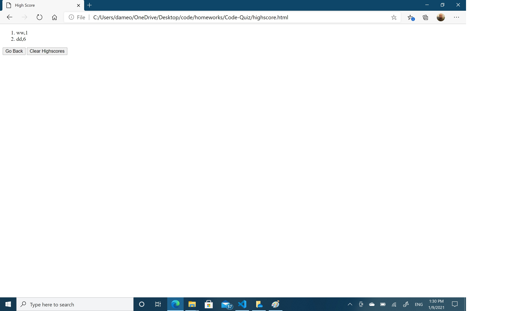

# Code-Quiz

I want to make an application that generate a quiz.

- Have a start button that starts the quiz.
- Display question and answers
- When I click on an answer then the next question is displayed
- Display the score when the timer is done or I answers all question
- Have a submit button that save initials and score
- Have a button that erase the local memory
- Have a button that restarts the quiz
  
  
  
